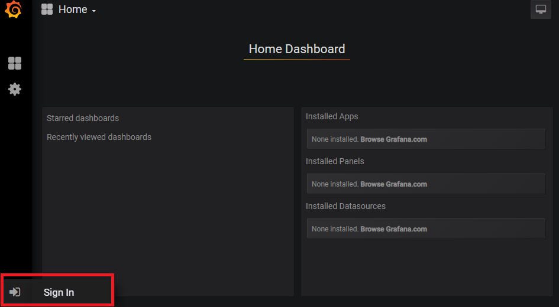
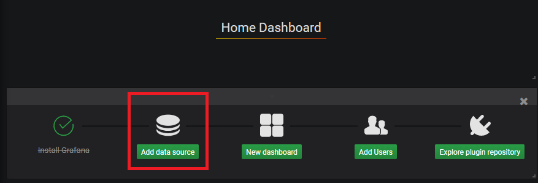
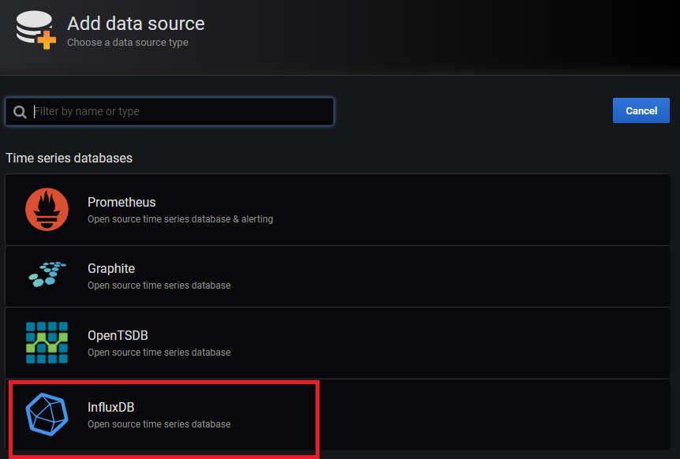
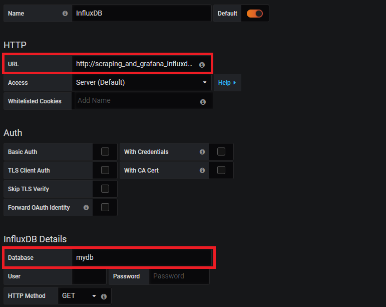

# Scraping and grafana

- App(Python)
  - Scraping external Internet page.
  - Processing the acquired data.
  - Insert data into database(Influxdb).
- Grafana
  - Visualize data stored in Influxdb
  - Listen port number 3000(Default).
- Influxdb
  - This is a time series database.
  - When data is inserted, records time stamp automatically.
  - Listen port number 8086(Default).

# Disclaimer

- Please check the terms of service carefully before collecting information via web scraping.
- In some cases, not only does it impose a performance load on the service, it may not be allowed by the privacy policy.
- We are not responsible for any troubles caused by using this tool.

12, Aug, 2019 - Shota Kokado, Japan.

[日本語による免責事項](doc/ja_disclaimer.md)

# Usage

## Rerquirement

### docker
```
$ docker -v
Docker version 1.13.1, build 1185cfd/1.13.1
```

### docker-compose
```shell
$ docker-compose -v
docker-compose version 1.24.1, build 4667896b
```

### Conainer images
- python: 3.7.4-alpine3.10
- grafana: 6.3.2
- influxdb: 1.7
```shell
$ docker images
REPOSITORY                  TAG                 IMAGE ID            CREATED             SIZE
docker.io/grafana/grafana   6.3.2               076e8bb899f2        5 days ago          254 MB
docker.io/python            3.7.4-alpine3.10    930a7e894675        2 weeks ago         98.7 MB
docker.io/influxdb          1.7                 d1e103e42e17        4 weeks ago         258 MB
```

## setup

### First

```shell
$ git clone https://github.com/skokado/scraping_and_grafana
$ cd scraping_and_grafana
$ mkdir influxdb # Create data directory of influxdb.
```

### Create database

First, run a container from official image.

```shell
$ docker run -d --rm --name infludb \
  -p 8086:8086 \
  -v `pwd`/influxdb:/var/lib/influxdb \
  docker.io/influxdb:1.7
f12ee****
```
and, Create database in interactive cli.<br>
※In the following, the database name is "mydb"
```shell
$ docker exec -it influxdb influx -precision rfc333
Connected to http://localhost:8086 version 1.7.7
InfluxDB shell version: 1.7.7
>
> CREATE DATABASE mydb
> show databases
name: databases
name
----
_internal
mydb
> exit
$ docker kill influxdb
influxdb
```

### app/main.py

Replace target url you want to do scraping.
```python
    url = 'https://url.of.webpage/' # スクレイピング先URL
```
※At line 58

### app/Dockerfile
Replace environment variables in `app/Dockerfile`.
```Dockerfile
FROM docker.io/python:3.7.4-alpine3.10

RUN apk add --no-cache bash && \
    pip3 --no-cache-dir install influxdb urllib3 beautifulsoup4 certifi

COPY ./main.py /app/main.py

ENV INFLUXDB_HOST="Your_Container_Name" \
    INFLUXDB_PORT="8086" \
    INFLUXDB_DATABASE="Your_DATABASE_Name"
```
※When using docker-compose, `INFLUXDB_HOST` defaults to `scraping_and_grafana_influxdb_1` in this app.

### Add permission of grafana data directory

```shell
$ mkdir grafana/data
$ chmod 777 grafana/data
```

## Run containers

```shell
$ docker-compose up -d --build
$ docker-compose ps
CONTAINER ID        IMAGE                          COMMAND                  CREATED             STATUS              PORTS                    NAMES
8390ca62b4a0        scraping_and_grafana_grafana   "/run.sh"                3 minutes ago       Up 12 seconds       0.0.0.0:3000->3000/tcp   scraping_and_grafana_grafana_1
37c82fbcd8b9        scraping_and_grafana_app       "/bin/bash -c 'whi..."   3 minutes ago       Up 12 seconds                                scraping_and_grafana_app_1
fc78da6dd309        docker.io/influxdb:1.7         "/entrypoint.sh in..."   3 minutes ago       Up 14 seconds       0.0.0.0:8086->8086/tcp   scraping_and_grafana_influxdb_1
```

## Setting grafana

### Login
Access to `http://localhost:3000`<br>
(or your http://[container_host]:3000).

In default, username and password: `admin/admin`.
<br>
<br>


### Setup data source

Select "Add data source" and influxdb.

<br>
<br>
<br>

Input data source information(In default)
- URL: `http://scraping_and_grafana_influxdb_1:8086`
- Database: `mydb`
